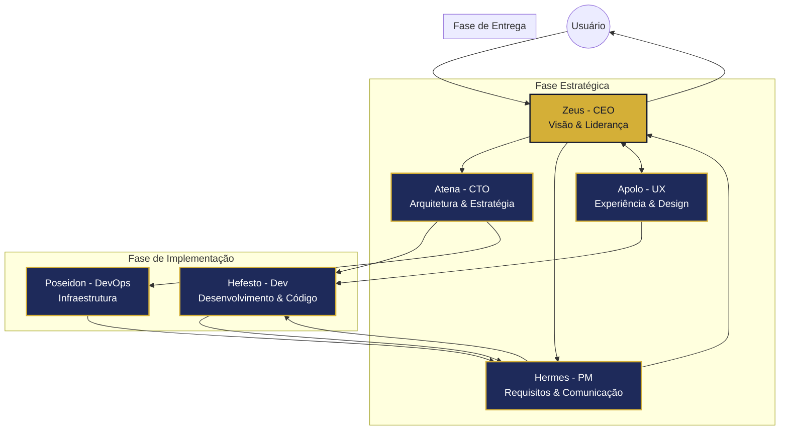

# Fluxo de Comunicação entre Agentes

O diagrama abaixo ilustra como os diferentes agentes (deuses) do Olympus Tech interagem e colaboram durante o ciclo de vida de um projeto. Cada agente possui especialidades específicas, mas trabalha em conjunto com os demais para entregar soluções completas.

## Explicação do Fluxo

### 1. Fase Estratégica

- O usuário inicia a interação com **Zeus (CEO)**, que define a visão geral do projeto
- **Zeus** delega aspectos específicos para:
  - **Atena (CTO)** para definição da arquitetura e estratégia técnica
  - **Hermes (PM)** para refinamento de requisitos e comunicação
  - **Apolo (UX)** para aspectos de experiência do usuário e design

### 2. Fase de Implementação

- **Atena** direciona **Hefesto (Desenvolvedor)** na implementação técnica
- **Apolo** fornece especificações de design para **Hefesto**
- **Hermes** transmite requisitos refinados para **Hefesto**
- **Atena** também orienta **Poseidon (DevOps)** na configuração da infraestrutura

### 3. Fase de Entrega

- **Hefesto** entrega o código e implementações para **Hermes**
- **Poseidon** entrega a infraestrutura configurada para **Hermes**
- **Hermes** consolida as entregas e reporta para **Zeus**
- **Zeus** apresenta o resultado final ao **Usuário**

## Interações Adicionais

Embora não demonstrado explicitamente no diagrama, existem muitas interações diretas entre os agentes durante o processo, como:

- **Hefesto** consultando diretamente **Atena** para decisões técnicas
- **Apolo** e **Hefesto** colaborando em ajustes de interface
- **Poseidon** e **Hefesto** trabalhando juntos em aspectos de deployment

O modelo permite flexibilidade, permitindo que o usuário interaja diretamente com qualquer agente quando necessário para tarefas específicas.

## Áreas de Sobreposição

Os agentes compartilham certas áreas de conhecimento, criando sobreposições produtivas:

- **Atena & Hefesto**: Compartilham conhecimento técnico
- **Zeus & Hermes**: Ambos focados em aspectos estratégicos e comunicação
- **Apolo & Hermes**: Colaboram na tradução de necessidades do usuário
- **Hefesto & Poseidon**: Ambos envolvidos no ciclo de desenvolvimento e implementação

Estas sobreposições garantem consistência no sistema e permitem abordagens complementares para problemas complexos.
