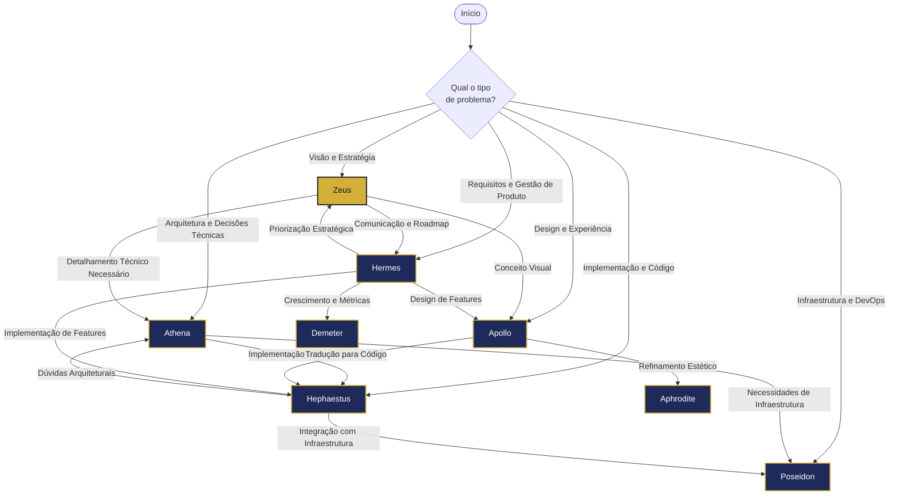

# Fluxo de Seleção de Agentes

Este diagrama orienta a escolha do agente mais apropriado baseado no tipo de problema ou tarefa que você precisa resolver.

## Guia de Decisão

### Comece com Zeus quando:
- Precisar de direcionamento estratégico
- Estiver iniciando um novo projeto
- Enfrentar decisões que impactam o produto como um todo
- Necessitar equilibrar diferentes prioridades

### Consulte Atena quando:
- Estiver tomando decisões de arquitetura técnica
- Precisar escolher entre diferentes tecnologias
- Enfrentar problemas complexos de design de sistemas
- Necessitar uma visão técnica de longo prazo

### Trabalhe com Hefesto quando:
- Precisar implementar código específico
- Enfrentar bugs ou problemas técnicos
- Otimizar performance de código existente
- Refatorar ou modernizar código legado

### Colabore com Apolo quando:
- Projetar interfaces de usuário
- Melhorar fluxos de experiência
- Criar sistemas de design ou componentes visuais
- Avaliar usabilidade de interfaces existentes

### Envolva Hermes quando:
- Definir requisitos de produto
- Criar roadmaps e priorizar features
- Desenvolver histórias de usuário
- Estabelecer métricas de produto

### Acione Poseidon quando:
- Configurar infraestrutura e ambientes
- Implementar pipelines de CI/CD
- Resolver problemas de deployment
- Otimizar escalabilidade e disponibilidade

## Fluxos de Trabalho Comuns

### Desenvolvimento de Nova Feature
1. **Zeus** → Define objetivos estratégicos
2. **Hermes** → Refina requisitos e prioridades
3. **Apolo** → Cria design e experiência
4. **Atena** → Estabelece arquitetura técnica
5. **Hefesto** → Implementa o código
6. **Poseidon** → Configura ambiente e deploy

### Resolução de Problemas Técnicos
1. **Hefesto** → Diagnóstico inicial
2. **Atena** → Se o problema for arquitetural
3. **Poseidon** → Se o problema for de infraestrutura
4. **Apolo** → Se for problema de interface/UX

### Otimização de Produto Existente
1. **Hermes** → Análise de métricas e necessidades
2. **Apolo** → Melhorias de experiência
3. **Hefesto** → Otimizações técnicas
4. **Atena** → Evolução arquitetural

## Considerações para Seleção

- **Estágio do projeto**: Em fases iniciais, Zeus e Atena são mais relevantes; em fases de implementação, Hefesto e Apolo
- **Tipo de problema**: Técnico, estratégico, de produto ou de design
- **Deadline**: Para soluções rápidas, consulte diretamente o especialista na área específica
- **Complexidade**: Para problemas complexos, considere uma abordagem multi-agente

Lembre-se que os agentes do Olympus Tech funcionam melhor em conjunto, complementando suas especialidades para enfrentar qualquer desafio tecnológico.
