# Ciclo de Vida do Projeto com Atena

Este diagrama ilustra os momentos-chave para consultar e envolver a deusa Atena (CTO/Arquiteta) ao longo do ciclo de vida de um projeto de software.

```mermaid
flowchart TB
    subgraph "Fase de Concepção"
        A1[Visão Inicial] --> A2[Requisitos de Alto Nível]
        A2 --> A3[Análise de Viabilidade]
        A3 --> A4[Recomendações Arquiteturais]
        
        style A4 fill:#D4AF37,stroke:#10152B,stroke-width:2px
    end
    
    subgraph "Fase de Planejamento"
        B1[Definição de Escopo] --> B2[Seleção de Tecnologias]
        B2 --> B3[Decisões Arquiteturais]
        B3 --> B4[Documentação Técnica]
        
        style B2 fill:#D4AF37,stroke:#10152B,stroke-width:2px
        style B3 fill:#D4AF37,stroke:#10152B,stroke-width:2px
    end
    
    subgraph "Fase de Desenvolvimento"
        C1[Setup Inicial] --> C2[Desenvolvimento Incremental]
        C2 --> C3[Revisões Técnicas]
        C3 --> C4[Refatorações]
        
        style C1 fill:#D4AF37,stroke:#10152B,stroke-width:2px
        style C3 fill:#D4AF37,stroke:#10152B,stroke-width:2px
    end
    
    subgraph "Fase de Teste"
        D1[Testes Unitários] --> D2[Testes de Integração]
        D2 --> D3[Testes de Performance]
        D3 --> D4[Validação Arquitetural]
        
        style D3 fill:#D4AF37,stroke:#10152B,stroke-width:2px
        style D4 fill:#D4AF37,stroke:#10152B,stroke-width:2px
    end
    
    subgraph "Fase de Implantação"
        E1[Preparação de Ambiente] --> E2[Estratégia de Deploy]
        E2 --> E3[Monitoramento Inicial]
        E3 --> E4[Ajustes Pós-Deploy]
        
        style E2 fill:#D4AF37,stroke:#10152B,stroke-width:2px
    end
    
    subgraph "Fase de Manutenção"
        F1[Operação Contínua] --> F2[Análise de Performance]
        F2 --> F3[Evolução Arquitetural]
        F3 --> F4[Planejamento de Modernização]
        
        style F2 fill:#D4AF37,stroke:#10152B,stroke-width:2px
        style F3 fill:#D4AF37,stroke:#10152B,stroke-width:2px
        style F4 fill:#D4AF37,stroke:#10152B,stroke-width:2px
    end
    
    A4 --> B1
    B4 --> C1
    C4 --> D1
    D4 --> E1
    E4 --> F1
    F4 -.-> A1
```

## Pontos de Intervenção Crítica de Atena

Os blocos destacados em dourado representam momentos onde a consulta a Atena é particularmente valiosa:

### 1. Fase de Concepção
- **Recomendações Arquiteturais**: Atena avalia a visão do produto e fornece direcionamentos arquiteturais iniciais, considerando requisitos não-funcionais cruciais como escalabilidade, segurança e manutenibilidade.

### 2. Fase de Planejamento
- **Seleção de Tecnologias**: Atena guia a escolha de linguagens, frameworks e ferramentas alinhados com os requisitos e objetivos do projeto.
- **Decisões Arquiteturais**: Documentação de decisões fundamentais (ADRs) que moldarão o sistema, como padrões arquiteturais, estratégias de armazenamento e comunicação entre componentes.

### 3. Fase de Desenvolvimento
- **Setup Inicial**: Atena orienta a configuração correta do ambiente de desenvolvimento e estabelecimento de padrões técnicos.
- **Revisões Técnicas**: Análise periódica para garantir aderência aos princípios arquiteturais e identificar potenciais problemas técnicos antes que se agravem.

### 4. Fase de Teste
- **Testes de Performance**: Atena ajuda a projetar cenários de teste de carga e stress para validar se a arquitetura suporta os requisitos não-funcionais.
- **Validação Arquitetural**: Verificação holística se a implementação está alinhada com a visão arquitetural original.

### 5. Fase de Implantação
- **Estratégia de Deploy**: Orientação sobre abordagens de implantação que minimizam riscos e garantem transições suaves.

### 6. Fase de Manutenção
- **Análise de Performance**: Avaliação de métricas operacionais para identificar gargalos ou ineficiências arquiteturais.
- **Evolução Arquitetural**: Planejamento de evolução gradual da arquitetura para acomodar novos requisitos mantendo a estabilidade.
- **Planejamento de Modernização**: Definição de estratégias para atualização de componentes legados ou migração para novas tecnologias.

## Benefícios da Consulta a Atena nos Momentos Apropriados

- **Prevenção de problemas**: Identificação antecipada de riscos arquiteturais
- **Coerência técnica**: Manutenção da integridade arquitetural ao longo do projeto
- **Eficiência de desenvolvimento**: Direcionamento claro para equipes técnicas
- **Sustentabilidade**: Arquitetura que suporta crescimento e evolução
- **Balanceamento de trade-offs**: Decisões ponderadas entre diferentes requisitos conflitantes

## Como Envolver Atena Efetivamente

1. **Apresente o contexto completo**: Objetivos de negócio, restrições técnicas, prioridades
2. **Defina claramente a questão arquitetural**: Seja específico sobre o problema ou decisão
3. **Compartilhe artefatos relevantes**: Diagramas, documentos de requisitos, métricas
4. **Especifique o nível de detalhe necessário**: Direcionamento de alto nível ou especificações detalhadas
5. **Agende revisões arquiteturais periódicas**: Mantenha Atena envolvida continuamente, não apenas em crises

Lembre-se: A sabedoria arquitetural de Atena é mais valiosa quando aplicada preventivamente, não apenas como resposta a problemas.
