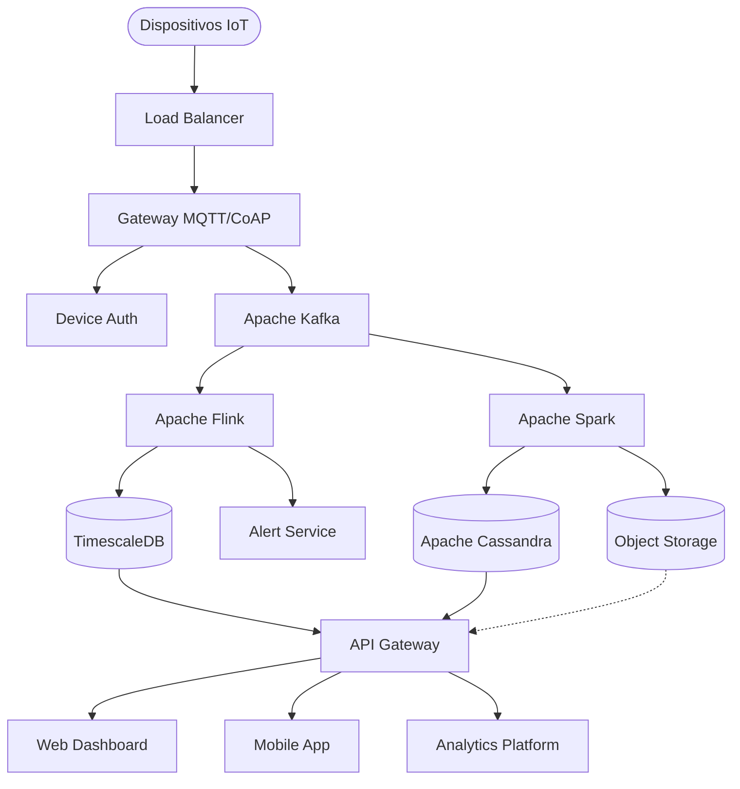

# Arquitetura com Atena

Este guia apresenta como trabalhar efetivamente com o Agente Atena para definir e implementar arquiteturas técnicas sólidas para seus projetos.

## O Papel da Atena na Arquitetura

Como deusa da sabedoria e estratégia, Atena traz para o Olympus Tech:

- Visão holística de sistemas complexos
- Sabedoria técnica baseada em padrões comprovados
- Capacidade de equilibrar diferentes forças e requisitos
- Pensamento estratégico para soluções sustentáveis a longo prazo

## Quando Consultar Atena

Os momentos ideais para consultar Atena incluem:

- **Início de projetos** - Para definição da arquitetura base
- **Decisões técnicas críticas** - Quando há várias opções viáveis
- **Evolução de sistemas** - Para estratégias de modernização
- **Problemas técnicos complexos** - Para análise e resolução estruturada
- **Avaliação de tecnologias** - Para comparação objetiva de opções

## Processo de Trabalho com Atena

### 1. Preparação para Consulta

**Reúna as informações necessárias:**

- Requisitos funcionais e não-funcionais do projeto
- Restrições técnicas (infraestrutura existente, regulatórias)
- Métricas esperadas (performance, escalabilidade, segurança)
- Contexto do negócio e objetivos estratégicos
- Stack tecnológico existente ou preferências da equipe

### 2. Estruturando a Consulta

Formule sua solicitação à Atena seguindo este modelo:

```
Atena, preciso definir a arquitetura para [tipo de sistema].

Contexto:
- Requisitos principais: [listar requisitos-chave]
- Escala esperada: [volumes, usuários, dados, etc.]
- Restrições: [limitações importantes]
- Prioridades não-funcionais: [ex: segurança, performance, manutenibilidade]

Por favor, proponha uma arquitetura que atenda a esses critérios,
explicando os componentes principais e as razões para suas escolhas.
```

### 3. Analisando e Refinando

Após receber a proposta inicial de Atena:

1. **Analise criticamente** cada componente e sua justificativa
2. **Questione pressupostos** ou áreas que necessitam mais detalhamento
3. **Explore trade-offs** mencionados e suas implicações
4. **Solicite alternativas** para áreas críticas ou de alto risco
5. **Refine iterativamente** a arquitetura com perguntas específicas

### 4. Documentação da Arquitetura

Peça a Atena para formalizar a arquitetura definida em:

- **Diagramas** - C4 Model, diagramas de componentes, etc.
- **ADRs (Architecture Decision Records)** - Documentando decisões-chave
- **Matriz de tecnologias** - Stack tecnológico com justificativas
- **Roteiro de implementação** - Sequenciamento recomendado

## Exemplo Prático: Sistema de Gerenciamento de Dados IoT

### Consulta Inicial

```
Atena, precisamos definir uma arquitetura para um sistema de gerenciamento de dados IoT.

Contexto:
- Sistema receberá dados de ~10.000 dispositivos enviando leituras a cada 30 segundos
- Necessita armazenar histórico por 2 anos e permitir análises em tempo real
- Deve suportar diferentes tipos de sensores e protocolos IoT (MQTT, CoAP)
- Alta disponibilidade é crítica (máximo 10min de downtime/mês)
- Equipe tem experiência principalmente com tecnologias Java e SQL

Por favor, proponha uma arquitetura adequada com justificativas.
```

### Resposta Estruturada da Atena

```
# Arquitetura para Sistema de Gerenciamento de Dados IoT

## VISÃO GERAL
Proponho uma arquitetura em camadas com processamento de stream em tempo real,
combinada com armazenamento híbrido para equilibrar acesso rápido com retenção
de longo prazo.

## COMPONENTES PRINCIPAIS

### 1. Camada de Ingestão
- **Gateway IoT**: Implementado com Eclipse Mosquitto (MQTT) e CoAP Proxy
- **Balanceador de Carga**: NGINX para distribuir conexões entre instâncias
- **Autenticação de Dispositivos**: Sistema baseado em certificados X.509
- **Buffering**: Apache Kafka para desacoplar ingestão de processamento

Justificativa: Esta camada garante recepção confiável de dados mesmo com picos de tráfego,
usando protocolos leves como MQTT que são ideais para IoT. Kafka proporciona
resiliência e garante que nenhum dado seja perdido mesmo durante manutenções.

### 2. Processamento
- **Stream Processing**: Apache Flink (Java API) para processamento em tempo real
- **Batch Processing**: Apache Spark para análises complexas em lote
- **Normalização de Dados**: Serviço personalizado em Java para padronizar formatos

Justificativa: Flink permite processamento com latência baixa (ms) para alertas e
dashboards, enquanto Spark é otimizado para análises complexas em grandes volumes
de dados históricos. A dualidade atende tanto necessidades em tempo real quanto análises profundas.

### 3. Armazenamento
- **Hot Storage**: TimescaleDB (extensão PostgreSQL para séries temporais)
- **Warm Storage**: Apache Cassandra para dados de médio prazo (1-3 meses)
- **Cold Storage**: Object Storage (S3 ou equivalente) para histórico completo
- **Metadados**: PostgreSQL para dados relacionais (dispositivos, configurações)

Justificativa: Esta estratégia híbrida oferece custo-benefício ideal, mantendo
dados recentes em armazenamento rápido e migrando automaticamente para opções
mais econômicas conforme envelhecem, sem perder a capacidade analítica.

### 4. API e Aplicações
- **Gateway API**: Spring Boot com caching (Redis)
- **Autenticação/Autorização**: OAuth 2.0 com Keycloak
- **Aplicação Web**: React com gráficos em tempo real (WebSockets)
- **Analytics**: Superset ou Grafana para visualizações e dashboards

Justificativa: APIs RESTful com Spring Boot aproveitam a experiência existente da equipe
em Java, enquanto o frontend desacoplado permite evolução independente da interface.

## CONSIDERAÇÕES CRÍTICAS

### Escalabilidade
- Componentes stateless em containers para escala horizontal
- Sharding nos bancos de dados baseado em dispositivo/tempo
- Auto-scaling baseado em métricas de utilização

### Confiabilidade
- Arquitetura ativa-ativa em múltiplas zonas de disponibilidade
- Circuit breakers entre componentes para evitar falhas em cascata
- Sistema de alertas proativos para anomalias

### Segurança
- TLS/mTLS em todas as comunicações
- Criptografia em repouso para todos os dados
- Gerenciamento centralizado de secrets

## DIAGRAMA DE ARQUITETURA



## ESTRATÉGIA DE IMPLEMENTAÇÃO
Recomendo uma abordagem incremental:

1. MVP inicial com ingestão MQTT, processamento básico e TimescaleDB
2. Adicionar pipelines de processamento em tempo real
3. Implementar estratégia de múltiplas camadas de armazenamento
4. Expandir capacidades analíticas

Esta sequência permite validar componentes críticos rapidamente e obter feedback.
```

## Trabalhando com Atena e Hefesto em Conjunto

A colaboração entre Atena e Hefesto representa a união perfeita entre planejamento arquitetural e implementação concreta:

- **Atena** define a visão arquitetural, padrões e decisões estruturais
- **Hefesto** implementa componentes específicos, proof-of-concepts e soluções técnicas

Para projetos complexos, considere sessões de trabalho onde ambos os agentes contribuem:

```
@Atena e @Hefesto, estamos implementando um sistema de microsserviços e precisamos:
1. Da arquitetura geral (Atena)
2. De um serviço exemplo com implementação completa (Hefesto)

Por favor, colaborem para criar uma solução consistente que possamos usar como modelo.
```

## Documentando Decisões Arquiteturais (ADRs)

Após decisões arquiteturais importantes, peça à Atena para documentá-las como ADRs:

```
Atena, poderia formalizar nossa decisão sobre a arquitetura de armazenamento
em um ADR (Architecture Decision Record) para documentação e referência futura?
```

A estrutura típica de um ADR inclui:

1. **Título e status** (Proposto, Aceito, Depreciado, etc.)
2. **Contexto** que levou à decisão
3. **Decisão** tomada com detalhes técnicos
4. **Consequências** positivas e negativas
5. **Alternativas** consideradas e razões para não serem escolhidas

## Integrando com o Ciclo de Vida do Projeto

As interações com Atena são mais valiosas em momentos específicos:


- **Fase de Concepção**: Definição inicial da arquitetura
- **Pontos de Decisão**: Quando escolhas técnicas significativas são necessárias
- **Revisões de Arquitetura**: Validação periódica das decisões arquiteturais
- **Evolução/Refatoração**: Planejamento de modernizações e atualizações

## Dicas para Interação Efetiva

1. **Seja específico sobre requisitos não-funcionais** - Atena precisa entender as prioridades reais
2. **Questione pressupostos** - Entenda o raciocínio por trás das recomendações
3. **Considere o longo prazo** - Atena excele em prever necessidades futuras
4. **Combine com conhecimento específico do domínio** - Agregue seu conhecimento do negócio
5. **Documente iterativamente** - A arquitetura deve evoluir com o entendimento do problema

---

<div class="olympus-card">
Lembre-se: Uma boa arquitetura não é rígida, mas adaptável. Retorne periodicamente à Atena para reavaliar decisões conforme o projeto evolui e novos requisitos emergem.
</div>
